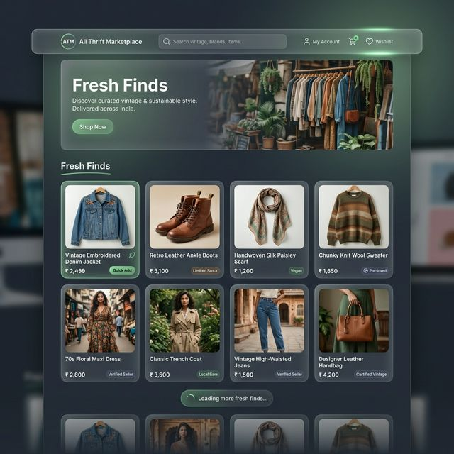

# ATM - All Thrift Marketplace

ATM (All Thrift Marketplace) is a premium, sustainable e-commerce platform curated for the Indian market. It specializes in vintage pieces and thrifted treasures, providing a modern social-media-inspired shopping experience.

---

## 🧐 What is this?

**ATM** is a high-end thrift marketplace designed to bring the "treasure hunt" experience of physical thrift shops into a sleek, digital environment. It combines the ease of modern e-commerce with the curated, unique nature of vintage shopping.

## 💡 Why did we build it?

Physical thrift stores in India are often unorganized or localized to specific markets. We built ATM to:
- **Democratize Thrift**: Provide a centralized, high-quality platform for pre-loved fashion.
- **Modernize the Experience**: Replace clunky listings with a smooth, social-media-style "Fresh Finds" feed.
- **Promote Sustainability**: Make sustainable fashion the "cool" and easy choice for the modern Indian consumer.

## 🚀 What problem does it solve?

Most marketplaces treat thrifted items like second-hand junk. ATM solves this by:
1. **Quality Perception**: Using a "glassmorphism" premium UI to elevate the perception of pre-owned items.
2. **Browsing Fatigue**: Implementing **Infinite Scroll** and **Intelligent Search** to make discovery effortless.
3. **Trust**: Providing a verified, curated look and feel that builds confidence in sustainable shopping.

---

## 📱 Screenshots



---

## 🚀 Features

- **Infinite Scrolling**: A seamless browsing experience with auto-loading products as you scroll.
- **Global Search**: High-performance header search for quick discovery of vintage finds.
- **Responsive Design**: Fully optimized for mobile, tablet, and desktop views with a "glassmorphism" aesthetic.
- **Dynamic Pricing**: Currency localized to INR (₹) with clean, premium typography.
- **Social Feel**: Curated "Fresh Finds" feed with smooth micro-animations.

## 🛠️ Tech Stack

- **Framework**: [Next.js 16](https://nextjs.org/) (App Router)
- **Library**: [React 19](https://reactjs.org/)
- **Language**: [TypeScript](https://www.typescriptlang.org/)
- **Styling**: Vanilla CSS with Modern Glassmorphism & Custom Properties.
- **Icons/Images**: Dynamic image placeholders and custom CSS icons.

## 📦 Project Structure

```text
src/
├── app/             # Next.js App Router pages and global styles
├── components/      # Reusable UI components
│   ├── Header/      # Sticky navigation with search
│   ├── ProductCard/ # Individual product display
│   └── ProductList/ # Responsive grid with infinite scroll logic
└── public/          # Static assets and logos
```

## 🛠️ Getting Started

### Prerequisites

- Node.js (Latest LTS recommended)
- npm, yarn, pnpm, or bun

### Installation

1. Install dependencies:
   ```bash
   npm install
   ```

2. Run the development server:
   ```bash
   npm run dev
   ```

3. Open [http://localhost:3000](http://localhost:3000) in your browser.

## 🤝 Contributing

This project is currently in development. Feel free to explore the code and suggest improvements.

## 📄 License

This project is private and proprietary.
